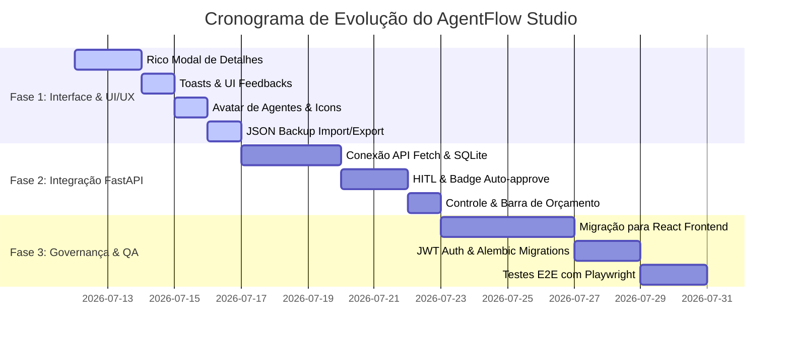

# Roteiro e Cronograma de Melhorias — AgentFlow Studio

> **Destinatário:** Claude (CLI / Claude Code)
> **Origem:** Ideias de evolução levantadas ao final da Fase 2.
> **Regra Suprema:** Execute cada FASE de forma isolada e atômica. Nunca misture tarefas de fases diferentes para evitar scope creep.

---

## 🗺️ Visão Geral do Roadmap

---

## 🎨 FASE 1: Polimento Visual, Detalhes Avançados do Kanban & UI/UX

*   **Foco:** Refatorar e enriquecer a interface do arquivo estático `Cria/AgentFlow_Studio_Kanban_Interativo.html`.
*   **Melhorias Contempladas:** M-009 (Modal de Abas), M-006 (Toasts elegantes), M-007 (Avatares por Agente), M-005 (Empty States e Skeletons), M-008 (Importação/Exportação JSON).

### 🧠 Skills Obrigatórias (Carregue-as antes de começar):
1.  **CSS Mastery:** [SKILL.md](file:///F:/Criando%20sites%20pelo%20pc/Site%20AgentFlow%20Studio/.claude/skills/css-mastery/SKILL.md) — Para criar as transições suaves e estilos do modal de abas.
2.  **UI/UX Pro Max:** [SKILL.md](file:///F:/Criando%20sites%20pelo%20pc/Site%20AgentFlow%20Studio/.claude/skills/ui-ux-pro-max/SKILL.md) — Para estilização de badges e feedbacks de interação.
3.  **JavaScript Mastery:** [SKILL.md](file:///F:/Criando%20sites%20pelo%20pc/Site%20AgentFlow%20Studio/.claude/skills/javascript-mastery/SKILL.md) — Para implementar o sistema de abas dinâmicas e exportação de blob.

### 📝 Detalhes da Execução:
*   **Modal de Detalhe por Abas (M-009):** O modal de visualização do card deve ter 4 abas:
    1.  *Geral:* Nome, descrição rica, prioridade e colunas.
    2.  *Checklist:* Sub-tarefas com checkboxes dinâmicos de progresso.
    3.  *Dependências:* Mapeamento visual simples de cards predecessores.
    4.  *Histórico:* Log de alterações (Ex: "Agente Ideation alterou status para Pendente").
*   **Notificações Toast (M-006):** Remover `alert()` e `confirm()`. Implementar uma div flutuante Toast no canto superior direito para dar feedback visual.
*   **Identificação por Agente (M-007):** Adicionar um avatar colorido com o logo/letra inicial do agente encarregado no canto inferior direito do card (ex: `I` para Ideation (Verde), `R` para Research (Azul), `P` para Planner (Amarelo)).

> 🚀 **Prompt de 1 Clique para passar para o Claude (Fase 1):**
> `Carregue de forma atômica as skills de .claude/skills/ui-ux-pro-max/SKILL.md, css-mastery e javascript-mastery. Abra o arquivo Cria/AgentFlow_Studio_Kanban_Interativo.html e implemente as melhorias da Fase 1 do roadmap (modal com abas, toasts para alertas, avatares para agentes nos cards e importação/exportação do quadro em JSON).`

---

## ⚡ FASE 2: Conexão FastAPI, Persistência em SQLite e Regras de Negócio

*   **Foco:** Transformar a interface estática em um aplicativo real conectado ao backend Python.
*   **Melhorias Contempladas:** M-011 (Persistência no SQLite via FastAPI), M-010 (Badge Auto-approve & HITL Gate), M-014 (Cap de Orçamento por projeto), M-001 (Salvar visualizações/filtros).

### 🧠 Skills Obrigatórias (Carregue-as antes de começar):
1.  **API Patterns:** [SKILL.md](file:///F:/Criando%20sites%20pelo%20pc/Site%20AgentFlow%20Studio/.claude/skills/api-patterns/SKILL.md) — Para criar os endpoints de sincronismo no FastAPI.
2.  **Python Pro:** [SKILL.md](file:///F:/Criando%20sites%20pelo%20pc/Site%20AgentFlow%20Studio/.claude/skills/python-pro/SKILL.md) — Para modelar e expor os endpoints.
3.  **HTTP Request Mastery:** [SKILL.md](file:///F:/Criando%20sites%20pelo%20pc/Site%20AgentFlow%20Studio/.claude/skills/http-request-mastery/SKILL.md) — Para lidar com os `fetch()` assíncronos no Javascript da interface.

### 📝 Detalhes da Execução:
*   **Sincronização com o Backend (M-011):** Substituir o `localStorage` do HTML por chamadas assíncronas `fetch` (GET/POST/PUT/DELETE) para o backend rodando na porta local do FastAPI. O backend deve ler/gravar na tabela SQLite de cartões.
*   **Visualização HITL & Auto-approve (M-010):** Se o progresso de confiança de um card no pipeline atingir `>= 0.85`, desenhar uma badge de Auto-approve (🤖) na barra superior do card indicando que ele avançará de fase automaticamente. Caso contrário, bloquear a transição de coluna exigindo aprovação manual (HITL Gate).
*   **Controle de Orçamento (M-014):** No Dashboard, criar um painel dinâmico que lê o custo total das execuções dos agentes no SQLite e exibe uma barra de orçamento limitadora (aviso amarelo aos 80% de gasto e bloqueio/travamento de novas tarefas aos 100%).

> 🚀 **Prompt de 1 Clique para passar para o Claude (Fase 2):**
> `Carregue as skills .claude/skills/api-patterns/SKILL.md e python-pro. Conecte o frontend estático HTML em Cria/ ao backend FastAPI recém-estruturado, trocando a gravação no localStorage por requisições HTTP REST diretas e implementando a barra de orçamentos no Dashboard e o badge do HITL (Auto-approve) nos cards.`

---

## 🛡️ FASE 3: Migração React, Segurança Avançada e Testes E2E (QA)

*   **Foco:** Unificar a stack e blindar a aplicação para ambiente de produção.
*   **Melhorias Contempladas:** M-015 (Unificação para React), M-016 (Segurança JWT), M-017 (Alembic Migrations), M-018 (Testes Playwright).

### 🧠 Skills Obrigatórias (Carregue-as antes de começar):
1.  **Security Hardening:** [SKILL.md](file:///F:/Criando%20sites%20pelo%20pc/Site%20AgentFlow%20Studio/.claude/skills/security-hardening/SKILL.md) — Para blindar as rotas FastAPI com autenticação JWT.
2.  **Test Driven Development:** [SKILL.md](file:///F:/Criando%20sites%20pelo%20pc/Site%20AgentFlow%20Studio/.claude/skills/test-driven-development/SKILL.md) — Para projetar e rodar testes de UI com Playwright.
3.  **Clean Code:** [SKILL.md](file:///F:/Criando%20sites%20pelo%20pc/Site%20AgentFlow%20Studio/.claude/skills/clean-code/SKILL.md) — Para portar a estrutura e hooks de renderização para o React.

### 📝 Detalhes da Execução:
*   **Migração para React (M-015):** Unificar os componentes HTML estilizados no diretório `frontend/` existente, criando componentes reutilizáveis (Sidebar, KanbanBoard, Card, DashboardMetrics, BudgetTracker).
*   **Segurança com JWT (M-016):** Criar tela de Login básica no frontend. No backend, adicionar middleware de autenticação validando token JWT nos headers de rotas privadas.
*   **Testes E2E Playwright (M-018):** Escrever arquivos de teste automatizados em `tests/` para testar o fluxo completo de criação de um card, simulação de drag-and-drop de uma coluna a outra, e o comportamento do tema escuro/claro.

> 🚀 **Prompt de 1 Clique para passar para o Claude (Fase 3):**
> `Carregue as skills .claude/skills/clean-code/SKILL.md, security-hardening e test-driven-development. Realize a unificação do HTML interativo para o projeto React em frontend/, blindando os endpoints com autenticação JWT e configurando testes E2E básicos com Playwright.`
